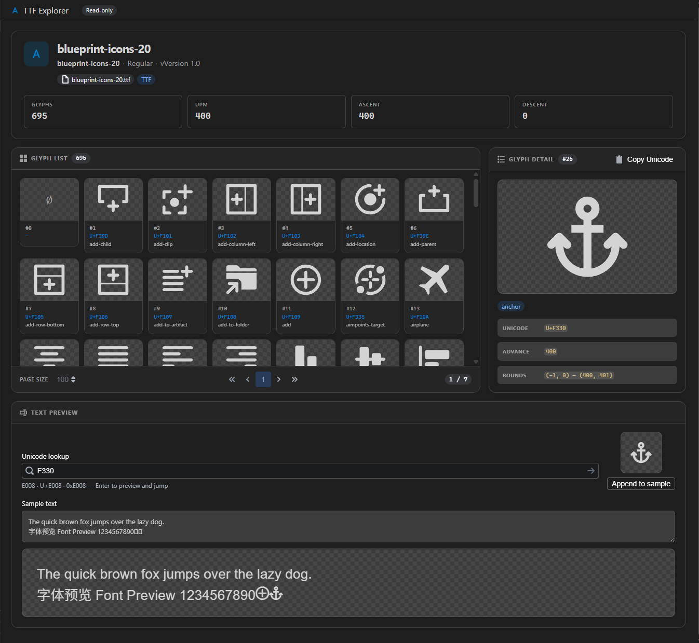

# TTF Explorer

<div align="center">


A VS Code extension for browsing TrueType (`.ttf`) font files in a read-only custom editor. Double-click a font file to inspect glyphs, metrics, and live text preview without leaving the editor.



</div>

## Features

- **Font metadata** — family name, subfamily, version, units per em, ascent/descent, glyph count
- **Glyph grid** — paginated thumbnail grid with Unicode code points and glyph names
- **Glyph detail** — large SVG outline preview with advance width and bounding box; copy Unicode to clipboard
- **Text preview** — type sample text rendered with the opened font via `@font-face`
- **Read-only** — browse fonts safely; no save or edit workflow
- **VS Code theme aware** — Blueprint UI adapts to light/dark editor themes

Parsing is powered by [fonteditor-core](https://github.com/kekee000/fonteditor-core), with UI patterns inspired by [fonteditor](https://github.com/ecomfe/fonteditor).

## Installation

### From VSIX

```bash
npm run pkg
code --install-extension ttf-explorer-0.1.0.vsix
```

### Development (Extension Development Host)

1. Open this folder in VS Code
2. Run `npm install` and `npm run compile`
3. Press **F5** to launch a new Extension Development Host
4. Open any `.ttf` file (e.g. `C:\Windows\Fonts\arial.ttf`)

## Usage

### Open TTF files

1. **Double-click** a `.ttf` file in the Explorer sidebar
2. Or **right-click** → **Open With…** → **TTF Explorer**
3. Or run the command palette: **Open in TTF Explorer**
4. Or use the editor title bar button when a `.ttf` tab is active

### Interface

| Area | Description |
| --- | --- |
| **Header** | Font name, version, UPM, metrics, file name |
| **Glyph grid** (left) | Click a glyph to select it; use pagination controls at the bottom |
| **Glyph detail** (right) | Outline preview and properties for the selected glyph |
| **Text preview** (bottom) | Edit sample text to preview the font in use |

## Settings

| Key | Default | Description |
| --- | --- | --- |
| `ttf-explorer.glyphPageSize` | `100` | Glyphs shown per page in the grid (10–500) |

## Development

### Prerequisites

- Node.js 18+
- VS Code 1.78+
- npm

### Commands

```bash
npm install          # Install dependencies
npm run compile      # Typecheck + build extension and webview bundles
npm run watch        # Rebuild on file changes
npm run compile:prod # Production build (minified)
npm run package      # Create .vsix (requires prior compile)
npm run pkg          # Clean, production build, and package
```

### Project layout

```
ttf-explorer/
├── src/                    # Extension host (Node)
│   ├── extension.ts
│   ├── webview/
│   │   ├── FontEditorProvider.ts   # CustomReadonlyEditorProvider
│   │   ├── WebviewManager.ts
│   │   ├── FontProcessor.ts        # fonteditor-core parsing
│   │   └── messageHandler.ts
│   └── commands/
├── webview/src/            # React + Blueprint UI
│   ├── App.tsx
│   └── components/
├── dist/                   # Built artifacts (extension.js, webview.js, webview.css)
└── esbuild.config.js       # Dual-bundle build
```

### Architecture

- **Extension host** reads the font file, parses it with `fonteditor-core`, and sends structured data to the webview via `postMessage`
- **Webview** renders the React UI; glyph SVG paths are computed on the host using `glyf2svg`
- Large fonts are handled with **paginated glyph loading** (`getFontData` + `getGlyphPage`)

Press **F5** with `.vscode/launch.json` to debug the extension.

## License

MIT © winse
